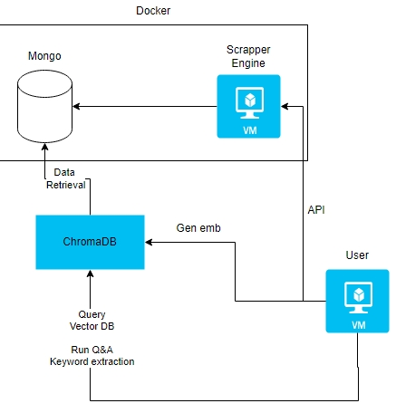
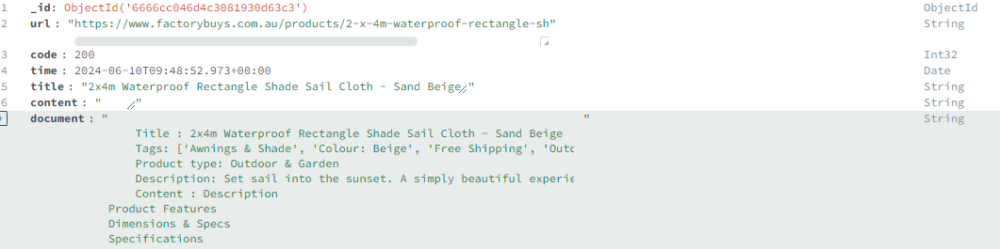
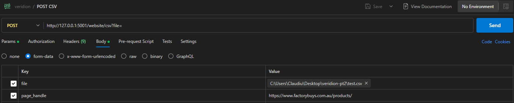
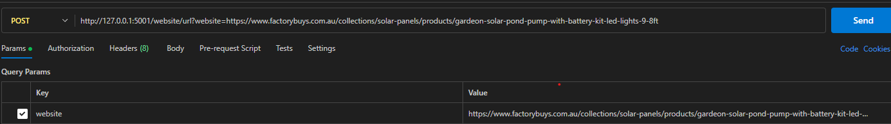

### RAG Product Database

Applying RAG for web scrapping

#### The project consists of an docker compose with
- scrapper - FastAPI engine to receive API calls for 
- - scrapping URL and insert into mongo
- - receive csv in products.json (Shopify Format) and scraps product pages
- database
- - MongoDB with data entries for document saving
- - ChromaDB to save embeddings for informancation retrieval

The files rag, askq we're created to use the GPU, calling them from CLI, not in container
- - rag.py contains embedding creations and insertion to chromadb
- - - querys mongodb and generates chunks of text
- - - generates embeddings with one of LLama, Mini-LM Hugging Face or any desired model (supported by langchain, code modification required)
- - - query_data_response (receives question and answwer based on the chunks created) and keyword_extract (extract essence of text from user input)
- - askq.py with arguments -q or -k (question or keyword for user input to RAG)


## Use case

##### Scrapper container receives GET/POST calls to do scrapping depending on use case (csv or URL)

##### RAG calls data written by Scrapper in MongoDB, generate embeddings based on chunks (fine tunning can be applied at chunks)

##### Calls LLM to answer based on the most similar results



Portable and only dependent on user machine to run the models (can be replaced with server with GPU)

# Results with LLama2 7-B (LLama.cpp), all-MiniLM-L6-v2 HF for embeddings 
```

python -q askq.py -q "What is the meaning of the number 42"
{'answer': "No results we're found regarding to this information"}

```

```

After calling http://127.0.0.1:5001/website/url?website=https://en.wikipedia.org/wiki/42_(number)
For scrapping

Answer:

Based on the provided context, the answer to the question "What is the meaning of the number 42?" is that it has a range of meanings and interpretations across various fields and cultures. Here are some examples:

Mathematics:
42 is the answer to the ultimate question of life, the universe, and everything in Douglas Adams' science fiction series "The Hitchhiker's Guide to the Galaxy."

Science:
The atomic number of molybdenum, a chemical element.

Astronomy:
The designation of the Messier 42 (M42), a star cluster located in the Orion constellation.

```

Where simiarity based items found where
```
page_content:
https://en.wikipedia.org/wiki/42_(number) 42 (number) - Wikipedia 200 Contents
42 (number)
Mathematics[edit]
Other properties[edit]
Science[edit]
Technology[edit]
Astronomy[edit]
Religion[edit]
Popular culture[edit]
The Hitchhiker's Guide to the Galaxy[edit]
Works of Lewis Carroll[edit]
Music[edit]

Metadata:
Collection: website
Database: documents
Start Index: 0
Score: 0.6507206159470947
```


```
page_content:
(Quoting from Scott Glazer): Trying to come up with a significant number to search for, I thought of 42 (the answer to life, the universe, and everything in Hitchhiker's Guide to the Galaxy.) 42 would be way too common of course, so I went for 424242. Came back that this shows up at position

Metadata:
Collection: website
Database: documents
Start Index: 19142
Score: 0.5732780597653842

```


Now we used 5000 product introduced into MongoDB (after scrapping)
```
python -q askq.py "Chair with Steel Metal, Textilene Fabric"

Query find runtime 3.4116580486297607 (250k chunks)

(r)
Please select one of the following options:
A) Dining Chair
B) Swing Chair
C) Sofa
```
A little hard for the model to find (some finetuning required) for search.

A test for the runtime speed is decent for 250k chunks of size 300

## Reduce the sample with a test.csv with 5 products only in the DB

```
python askq.py -q "Give me single mattresses"

(r) Example with only 5 entries in MongoDB
The information provided in the context is related to a single mattress, specifically the "Pyrite Bed & Mattress Package - Charcoal Single" product offered by Factory Buys. The details listed include the product name, description, dimensions and specs, specifications, what\'s included, warranty information, popular collections, customer care, trade and commercial, about us, contact us, headquarters, and a special offer of 10% off the first order and free shipping on mattresses. None of these details mention anything related to multiple mattresses. Therefore, the answer to the question is "single mattresses


With entry in db looking like:

    Title : Pyrite Bed & Mattress Package - Charcoal Single
    Tags: ['Bedroom', 'BedroomPackage', 'Colour: Grey/Charcoal', 'Hamptons Style', 'Kids Bedroom Packages', 'Material: Fabric', 'Size: Single']
    Product type: Packages
    Description: Sophisticated styling, simple clean lines and minimalist details ensure that the Milano Sienna Bed Frame will complement any decor.This bed frame and the complementary headboard is encased in a high-quality fabric upholstery with clean and smooth edges that complement the modern design and adds another layer of comfort to the bedroom experience.Pamper yourself with Factory Buys Euro Top Mattress that will give you a soothing sleep night after night.Incorporating the cutting-edge technology, the lavish construction addresses all elements that will offer you a comfortable and luxurious experience - Euro top padding with high-density foam and an independent coil system - made to provide you with an undisturbed sleep all night long.
    Content : 
    
With this promp template:

# To only answer based only the context provided only
PROMPT_TEMPLATE = """
Answer the question based only on the following context:

{context}

---

Answer the question based on the above context: {question}
"""
```

## Use case for keyword extractions
```

python -k "Mattres for home bedroom and sofa for living room"

Furnitures 
Home furniture: Mattress, Sofa, Chair.
Living room furniture: Sofa, Chair.

With this prompt template

KEY_WORD = """
You are an agent that extracts and classifies user input into product types furnitures:

{context}

---

Extract the key words to summary for data base usage like for example
2-Seater Hammock Bed Outdoor Chair Camping Hanging Hammocks Mesh
to
Outdoor Furniture

Solely classify in short words the input
"""
```
### Conclusions

We can use an combination of keywords extract and context data to answer fast to questions

After fine tunning and finding the best format for the data, we can answer based on our products 

And improve query speeds by computing similarity on GPU, use the keywords for filtering (hybrid search) and the slowest part

being the inference on the LLM model, moving it to GPU (taking around 3 mins to answer on 8 cores CPU)

In this we can improve runtime of the models on large amount of data and another use cased discussed 

### Finding bad data
    As we have information in form of embeddings for our documents we can
        (a) Create a classifier trained on embeddings to say this document contains good data (and replace value with other arrays for bad data)
        (b) Compute on the fly for bad data by similarity based comparison per document to see if the data is closely similar
            - having paragraphs for a sofa describing materials but containing voltage information at description shouldn`t be closely related


### Examples:

DB entry



API Calls with CSV



API Calls with link


